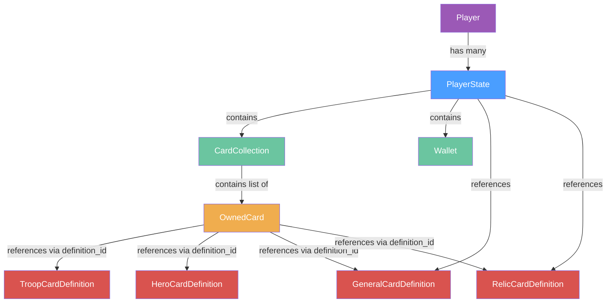

# Data Model: Player State Domain Model

## Domain Entities

### Player (NEW)

The identity anchor entity representing a player or simulation profile.
All other player-related aggregates reference this entity via `player_id`.

| Field        | Type       | Default    | Notes                                |
|--------------|------------|------------|--------------------------------------|
| `player_id`  | `str`      | *required* | Unique player identifier             |
| `name`       | `str`      | *required* | Display name                         |
| `created_at` | `datetime` | *required* | UTC, set once on creation            |

**Key**: `player_id`

---

### PlayerState (NEW)

The root aggregate representing a player's current game state. Stored as
versioned snapshots. References `Player` via `player_id`.

| Field                         | Type                   | Default            | Notes                                    |
|-------------------------------|------------------------|--------------------|------------------------------------------|
| `player_id`                   | `str`                  | *required*         | Unique player identifier (refs Player)   |
| `version`                     | `int`                  | `1`                | Monotonically increasing, set by repo    |
| `timestamp`                   | `datetime`             | *required*         | UTC, set by repo on save                 |
| `change_note`                 | `str \| None`          | `None`             | Describes what caused this version       |
| `collection`                  | `CardCollection`       | `CardCollection()` | Player's owned cards                     |
| `active_general_definition_id`| `str \| None`          | `None`             | Ref to a GeneralCardDefinition           |
| `equipped_relic_ids`          | `list[str]`            | `[]`               | Refs to RelicCardDefinitions             |
| `wallet`                      | `Wallet`               | `Wallet()`         | Player's currency                        |

**Key**: `(player_id, version)` — composite for versioned snapshots.

---

### OwnedCard (NEW — replaces CardInstance + HeroCardInstance)

A card instance owned by a player, tracked within `CardCollection`.

| Field                  | Type           | Default    | Notes                                           |
|------------------------|----------------|------------|-------------------------------------------------|
| `instance_id`          | `str`          | *required* | Unique instance identifier                      |
| `definition_id`        | `str`          | *required* | Ref to a card definition                        |
| `card_type`            | `CardType`     | *required* | TROOP, HERO, GENERAL, or RELIC                  |
| `level`                | `int`          | `1`        | Current level                                   |
| `experience`           | `int`          | `0`        | Accumulated XP                                  |
| `deployments_remaining`| `int \| None`  | `None`     | Hero-only: remaining deployments (cross-battle)  |

---

### CardCollection (NEW)

Value object containing the player's collection of owned cards.

| Field   | Type              | Default | Notes                       |
|---------|-------------------|---------|-----------------------------|
| `cards` | `list[OwnedCard]` | `[]`    | All cards the player owns   |

---

### Wallet (NEW)

Value object tracking the player's currency balances.

| Field  | Type  | Default | Notes          |
|--------|-------|---------|----------------|
| `gold` | `int` | `0`     | Primary currency |

---

## Removed Entities

### CardInstance (REMOVED)

Previously in `card.py`. Fields (`instance_id`, `definition_id`, `level`,
`experience`) are now represented by `OwnedCard` inside `CardCollection`.

### HeroCardInstance (REMOVED)

Previously in `card.py`. The `instance_id` and `definition_id` fields
are represented by `OwnedCard`. The `deployments_remaining` field is now
tracked as an optional field on `OwnedCard` (set for hero card types,
`None` for others), since hero deployments are a persistent cross-battle
concern — a hero can be deployed at most once per battle.

---

## Port Interfaces

### CardDefinitionRepository (NEW — replaces CardRepository)

Read-only port for card definition lookups across all card types.

| Method                          | Return Type                       | Notes                   |
|---------------------------------|-----------------------------------|-------------------------|
| `get_troop_definition(id)`      | `TroopCardDefinition \| None`     | Existing, moved here    |
| `get_hero_definition(id)`       | `HeroCardDefinition \| None`      | New                     |
| `get_general_definition(id)`    | `GeneralCardDefinition \| None`   | New                     |
| `get_relic_definition(id)`      | `RelicCardDefinition \| None`     | New                     |
| `list_troop_definitions()`      | `list[TroopCardDefinition]`       | New                     |
| `list_hero_definitions()`       | `list[HeroCardDefinition]`        | New                     |
| `list_general_definitions()`    | `list[GeneralCardDefinition]`     | New                     |
| `list_relic_definitions()`      | `list[RelicCardDefinition]`       | New                     |

### PlayerStateRepository (NEW)

Append-only versioned persistence for player state snapshots.

| Method                          | Return Type                   | Notes                                    |
|---------------------------------|-------------------------------|------------------------------------------|
| `save(state)`                   | `PlayerState`                 | Appends new version, returns with assigned version |
| `load(player_id, version=None)` | `PlayerState \| None`         | Latest if version is None; specific if given |
| `list_versions(player_id)`      | `list[int]`                   | Returns all version numbers in order     |

### PlayerRepository (NEW)

CRUD operations on player identity/profile.

| Method                          | Return Type           | Notes                            |
|---------------------------------|-----------------------|----------------------------------|
| `create(player)`                | `Player`              | Creates a new player; ID must be unique |
| `get(player_id)`                | `Player \| None`      | Returns player or None           |
| `list()`                        | `list[Player]`        | Returns all players              |
| `delete(player_id)`             | `bool`                | Returns True if deleted, False if not found |

### CardRepository (REMOVED)

The existing `CardRepository` port is removed. Its definition-read
methods move to `CardDefinitionRepository`. Its instance-write methods
are replaced by `PlayerStateRepository` (instances are now inside the
`PlayerState` aggregate).

---

## SQLModel Table Models

### PlayerTable (NEW)

| Column       | SQL Type    | Constraint   | Notes                                |
|--------------|-------------|--------------|--------------------------------------|
| `player_id`  | `VARCHAR`   | PK           | Unique player identifier             |
| `name`       | `VARCHAR`   | NOT NULL      | Display name                         |
| `created_at` | `DATETIME`  | NOT NULL      | UTC                                  |

### PlayerStateTable (NEW)

| Column        | SQL Type    | Constraint   | Notes                                |
|---------------|-------------|--------------|--------------------------------------|
| `player_id`   | `VARCHAR`   | PK (part 1)  | Composite PK with version            |
| `version`     | `INTEGER`   | PK (part 2)  | Composite PK with player_id          |
| `timestamp`   | `DATETIME`  | NOT NULL      | UTC, set on save                     |
| `change_note` | `VARCHAR`   | NULLABLE      | Optional audit trail                 |
| `data`        | `JSON`      | NOT NULL      | Full PlayerState serialized as JSON  |

### CardInstanceTable (REMOVED)

Dropped — instances are now stored inside `PlayerState.data` JSON.

### HeroCardInstanceTable (REMOVED)

Dropped — instances are now stored inside `PlayerState.data` JSON.

### TroopCardDefinitionTable (UNCHANGED)

Retained for `CardDefinitionRepository`. Future migrations may add
tables for hero, general, and relic definitions.

---

## Entity Relationships

**Legend**: Purple = Identity entity, Blue = State aggregate, Green = Value objects, Orange = Instance entity, Red = Definition entities (design-time)
